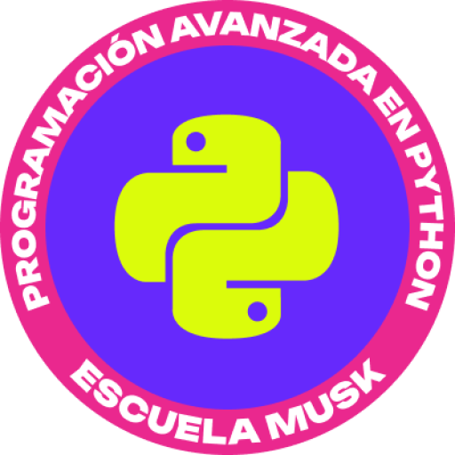

  <strong>Python · IoT · Energía solar · CNC · Impresión 3D · Astrofotografía</strong>

  Aprendiendo, construyendo y conectando distintas disciplinas mediante proyectos reales.

---

## 1. Sobre mí

Actualmente estoy ampliando y relacionando conocimientos en diferentes áreas técnicas:

- 🐍 Estoy absorbiendo conocimientos de **Python** y desarrollo de software.
- 🌐 Estoy aprendiendo sobre **IoT**, sensores, automatización y sistemas conectados.
- ☀️ Profundizo en **energía solar**, monitorización y gestión energética.
- ⚙️ Experimento con **CNC**, control de movimiento y fabricación digital.
- 🖨️ Aprendo sobre **impresión 3D**, diseño y prototipado.
- 🌌 Soy un apasionado de la **astrofotografía**, la astronomía y la observación del cielo.

Mi objetivo no es estudiar cada disciplina de forma aislada, sino comprender cómo pueden conectarse dentro de proyectos que combinen programación, electrónica, automatización, energía, fabricación y análisis de datos.

---

## 2. Conocimientos y tecnologías

Tecnologías que estoy aprendiendo, utilizando y relacionando dentro de mis proyectos:

### Programación y datos

  
  
  
  
  

### Desarrollo web

  
  
  

### IoT, electrónica y fabricación digital

  
  
  
  
  

### Sistemas y herramientas

  
  
  
  

---

## 3. Enlaces

  

---

## 4. Insignias y trofeos

### Programación avanzada en Python — Escuela Musk

  

  <em>Haz clic sobre la insignia para abrir el enlace asociado a la acreditación.</em>

### Trofeos de GitHub

  

---

## 5. Filosofía

### Español

> **La paciencia y la organización transforman la complejidad en progreso. Cuando el entusiasmo por aprender se combina con la capacidad de relacionar disciplinas diferentes, incluso los retos más difíciles se vuelven alcanzables. Pensar de manera distinta no significa abandonar el camino, sino descubrir nuevas formas de construirlo.**

### English

> **Patience and organization transform complexity into progress. When enthusiasm for learning is combined with the ability to connect different disciplines, even the most difficult challenges become achievable. Thinking differently does not mean leaving the path, but discovering new ways to build it.**

---

## 6. Contribuciones en GitHub

  

  

  

---

  <strong>Paciencia · Organización · Curiosidad · Aprendizaje constante</strong>

